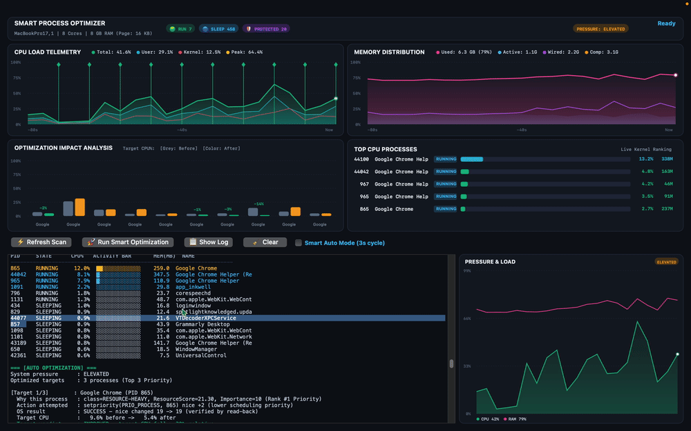
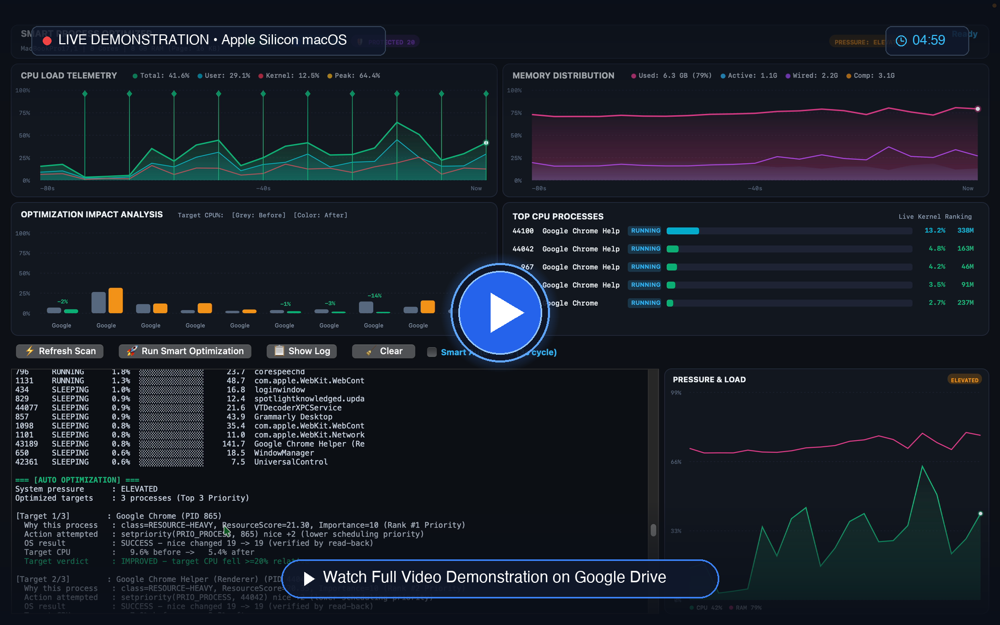

<div align="center">


**NSU CSE323 Operating Systems Course Project**  
*Platform: macOS Apple Silicon (ARM64) — MacBookPro17,1, 8 cores, 8 GB RAM*

[-4285F4?style=for-the-badge&logo=googledrive&logoColor=white)](https://drive.google.com/file/d/1N7y2BzGSoYYYDn8Czxz1FlbFoh8sr9tn/view)
[](https://drive.google.com/file/d/1N7y2BzGSoYYYDn8Czxz1FlbFoh8sr9tn/view)
[](https://drive.google.com/file/d/1N7y2BzGSoYYYDn8Czxz1FlbFoh8sr9tn/view)
[](https://drive.google.com/file/d/1N7y2BzGSoYYYDn8Czxz1FlbFoh8sr9tn/view)

<br/>

<a href="https://drive.google.com/file/d/1N7y2BzGSoYYYDn8Czxz1FlbFoh8sr9tn/view">
  
</a>

<br/><br/>

A C++17 application that reads **real process and system data directly from the macOS kernel**, scores every running process using a dual-score resource/importance model, performs **safe, real scheduling actions** via system calls (`setpriority`), measures whether performance actually improved, and **adapts its strategy from the results** — all with zero simulation and zero fake data.

<br/>

<a href="https://drive.google.com/file/d/1N7y2BzGSoYYYDn8Czxz1FlbFoh8sr9tn/view">
  
</a>
<br/>
👉 <b><a href="https://drive.google.com/file/d/1N7y2BzGSoYYYDn8Czxz1FlbFoh8sr9tn/view">Click Here to Open / Watch the Full Video on Google Drive</a></b>

</div>

---

<br/>

<h2 align="center">⏱️ Video Presentation Highlights & Timestamps</h2>

| Timestamp | Topic | Description |
|:---:|:---|:---|
| **0:00 – 0:45** | 💻 **System & Architecture Overview** | Hardware detection via `sysctlbyname` and live kernel telemetry via Mach interfaces (`host_statistics`, `host_statistics64`). |
| **0:45 – 1:40** | 📊 **Process Table & Dual-Score Model** | Live enumeration of 450+ processes via `libproc`/`sysctl(KERN_PROC_ALL)` and dual scoring (Resource Score vs. Importance Score). |
| **1:40 – 2:45** | ⚠️ **High-Pressure Detection & Top 3 Targets** | Automatic classification of system pressure and dynamic candidate prioritization among user processes. |
| **2:45 – 3:50** | 🛡️ **Safe Renicing & TOCTOU Guard** | Execution of `setpriority()` system call, read-back verification, and `proc_pidpath()` safety checks. |
| **3:50 – 4:59** | 📉 **Before/After Verification & Charts** | Verification of real CPU drops, multi-series dynamic Cocoa graphs, and adaptive feedback loop cooldown. |

<br/>

---

<br/>

<h2 align="center">✨ What Does This Program Do?</h2>

Smart Process Optimizer is an intelligent system resource manager. It continuously monitors every running process on your Mac, identifies processes that are consuming too many CPU or memory resources, and safely **lowers their scheduling priority** so the system runs smoother for the user.

<div align="center">
  
</div>

1. 🔍 **Real-Time Process Scanning** — Reads every process directly from the macOS kernel using `sysctl(KERN_PROC_ALL)` and `libproc`. Gets PID, name, state, CPU time, memory (RSS), thread count, nice value, and owner UID.
2. 📈 **System Resource Monitoring** — Measures actual system-wide CPU utilization and memory usage through Mach kernel interfaces (`host_statistics`, `host_statistics64`), the same source used by Activity Monitor.
3. 🧠 **Intelligent Scoring** — Every process is scored on two dimensions:
   - **Resource Score** (how much CPU/memory it uses)
   - **Importance Score** (how critical it is — system processes score high)
4. 🛡️ **Safe Optimization** — Only lowers scheduling priority (`nice` value) of user-owned processes. Never kills, never raises priority, never touches protected system processes.
5. ⚖️ **Before/After Measurement** — Every optimization is followed by a real measurement window to verify whether performance actually improved.
6. 🧬 **Adaptive Strategy** — The optimizer learns from failures: it increases its renice increment on consecutive failures and enters a cooldown mode after 3 failures in a row.
7. 🖥️ **Two Interfaces** — Terminal menu UI with Unicode graphics AND a native macOS Cocoa GUI with live line charts, bar graphs, and process tables.

<br/>

---

<br/>

<h2 align="center">⚙️ How Does Optimization Work?</h2>

The optimizer runs in cycles. Each cycle follows this precise sequence:

<div align="center">
<pre>
┌─────────────────────────────────────────────────────────────┐
│  <b>STEP 1: MEASURE BEFORE</b>                                     │
│  • Sleep 1 second, capture CPU tick counters                │
│  • Refresh all process CPU times                            │
│  • Read memory usage (active + wired + compressed)          │
│  • Classify system pressure: NORMAL / ELEVATED / HIGH       │
└──────────────────────────┬──────────────────────────────────┘
                           │
┌──────────────────────────▼──────────────────────────────────┐
│  <b>STEP 2: ANALYZE EVERY PROCESS</b>                              │
│  • For each of ~500+ processes:                             │
│    ResourceScore = 0.55 × CPU% + 0.30 × MEM% + 0.15 × State │
│    Importance    = 100 (protected) / 80 (nice<0) / 10 (norm)│
│    ActionPriority= ResourceScore × (1 − Importance/100)     │
│  • Eligibility check: own-UID only, not protected, score≥20 │
│  • Pick the ONE process with highest ActionPriority         │
└──────────────────────────┬──────────────────────────────────┘
                           │
┌──────────────────────────▼──────────────────────────────────┐
│  <b>STEP 3: TOCTOU SAFETY CHECK</b>                                │
│  • Re-verify target's identity via proc_pidpath()           │
│  • If PID was recycled by another process → ABORT, log it   │
└──────────────────────────┬──────────────────────────────────┘
                           │
┌──────────────────────────▼──────────────────────────────────┐
│  <b>STEP 4: APPLY ACTION</b>                                       │
│  • setpriority(PRIO_PROCESS, pid, nice + increment)         │
│  • increment = 2 + consecutiveFailures (capped at 5)        │
│  • Read back new nice value to verify it actually changed   │
└──────────────────────────┬──────────────────────────────────┘
                           │
┌──────────────────────────▼──────────────────────────────────┐
│  <b>STEP 5: MEASURE AFTER</b>                                      │
│  • Sleep 1 second, capture fresh CPU/memory numbers         │
│  • Re-analyze the target process's new CPU%                 │
│  • Compare BEFORE vs AFTER                                  │
└──────────────────────────┬──────────────────────────────────┘
                           │
┌──────────────────────────▼──────────────────────────────────┐
│  <b>STEP 6: VERDICT + ADAPT</b>                                    │
│  • Target CPU fell ≥20% relative → IMPROVED (success)       │
│  • System CPU dropped ≥1 point   → PARTIAL (success)        │
│  • Nothing changed               → NO IMPROVEMENT (failure) │
│  • 3 consecutive failures → cooldown: observe-only for 3 cyc│
│  • Log everything to smart_optimizer_activity.log           │
└─────────────────────────────────────────────────────────────┘
</pre>
</div>

<br/>

---

<br/>

<h2 align="center">🎯 Which Processes Does It Optimize?</h2>

### Eligibility Rules (ALL must be true)

| Rule | Reason |
|:---|:---|
| ✅ Must belong to the current user (`getuid()`) | Cannot and should not modify other users' processes |
| ✅ Must NOT be a protected process | System stability depends on these |
| ✅ ResourceScore must exceed threshold (≥20) | Only resource-heavy processes qualify |
| ✅ Must have measurable CPU usage | No point deprioritizing idle processes |

### Protected Processes (NEVER touched)

| Protection Rule | Processes Included |
|:---|:---|
| 🛑 **PID ≤ 100** | Kernel threads and early-boot processes |
| 🛑 **PID 1** (`launchd`) | macOS init system — killing it = instant crash |
| 🛑 **Root-owned processes** | Only root can modify root processes anyway |
| 🛑 **Own PID** | The optimizer cannot modify itself |
| 🛑 **Essentials list** | `kernel_task`, `launchd`, `WindowServer`, `loginwindow`, `spotlight`, `fs_usage`, `Activity Monitor` |
| 🛑 **`nice < 0`** | Already prioritized by the system for a reason |

### What Action Is Taken?

**Only one action: lower scheduling priority via `setpriority()`.**

```c
setpriority(PRIO_PROCESS, targetPID, currentNice + increment)
```

- `PRIO_PROCESS` = affect only this one process
- `currentNice + increment` = make it slightly less urgent to the scheduler
- `increment` starts at +2, grows to +5 with consecutive failures
- Acts concurrently on the **Top 3** highest priority candidate processes

> [!WARNING]
> **What we NEVER do:**
> - Never kill processes (`kill()`)
> - Never send signals (`SIGSTOP`/`SIGCONT` — reserved for manual control only)
> - Never raise priority
> - Never modify memory allocation
> - Never access process memory or inject code

<br/>

---

<br/>

<h2 align="center">🛠️ System Calls and OS Interfaces Used</h2>

| System Call | Purpose | Module |
|:---|:---|:---|
| `sysctl(KERN_PROC_ALL)` | Get list of all running processes | `process_monitor` |
| `sysctlbyname()` | Read hardware info (model, cores, RAM) | `system_info` |
| `proc_listpids()` | Alternative PID enumeration via libproc | `process_monitor` |
| `proc_pidpath()` | Get full executable path for a PID | `process_monitor`, `optimizer` |
| `proc_pidinfo()` | Get per-process CPU time, RSS, threads | `process_monitor` |
| `host_statistics()` | Read system-wide CPU tick counters | `resource_monitor` |
| `host_statistics64()`| Read system-wide memory page counts | `resource_monitor` |
| `getpriority()` | Read a process's current nice value | `process_controller` |
| `setpriority()` | Change a process's scheduling priority | `process_controller` |
| `getuid()` | Get current user ID for eligibility check | `optimizer` |
| `kill()` | Send SIGSTOP/SIGCONT (manual control only) | `process_controller` |
| `mach_absolute_time()` | High-resolution timing for measurements | `resource_monitor` |

<br/>

---

<br/>

<h2 align="center">🧠 Scoring Model (Detailed)</h2>

```text
ResourceScore = (0.55 × CPU%) + (0.30 × MEM%) + (0.15 × StateFactor)
```
- **CPU%**: Measured system-wide CPU utilization (0-100)
- **MEM%**: Memory used / total memory × 100 (0-100)
- **StateFactor**: 100.0 if RUNNING, 25.0 if SLEEPING, 0.0 if STOPPED

**ImportanceScore:**
- `100` = CRITICAL/PROTECTED (kernel_task, launchd, WindowServer, etc.)
- `80` = IMPORTANT (nice < 0, system services)
- `10` = NORMAL (ordinary user processes)

**Final Selection:**
```text
ActionPriority = ResourceScore × (1 − ImportanceScore/100)
```

<br/>

---

<br/>

<h2 align="center">🔬 macOS-Specific Findings (Experimental Results)</h2>

<details>
<summary><b>1. Apple Silicon Mach Tick Units</b> (Click to expand)</summary>
On Apple Silicon, <code>pti_total_user</code> and <code>pti_total_system</code> in <code>proc_pidinfo</code> are in raw Mach ticks (24 MHz), NOT nanoseconds. Ignoring this conversion understates CPU usage by exactly 41.67×.
</details>

<details>
<summary><b>2. Unreliable Process State Flags</b> (Click to expand)</summary>
<code>kinfo_proc.p_stat</code> returns SRUN (2) for nearly ALL live processes on modern macOS. Solution: state is inferred from measured CPU consumption over time.
</details>

<details>
<summary><b>3. PID-Reuse TOCTOU Race</b> (Click to expand)</summary>
Between scanning and acting, the OS can recycle a PID. Fixed: identity is re-verified via <code>proc_pidpath()</code> immediately before every syscall.
</details>

<br/>

---

<br/>

<h2 align="center">🚀 Build & Run</h2>

```bash
# Option 1: Using the interactive build & run script
./run.sh

# Option 2: Build & run Terminal UI manually
clang++ -std=c++17 -Wall -Wextra *.cpp -o smart_optimizer
./smart_optimizer

# Option 3: Build & run Native macOS GUI manually
clang++ -std=c++17 -Wall -fobjc-arc gui_main.mm \
  system_info.cpp resource_monitor.cpp process_monitor.cpp \
  process_analyzer.cpp important_process.cpp process_controller.cpp \
  optimizer.cpp activity_logger.cpp -framework Cocoa -o smart_optimizer_gui
./smart_optimizer_gui
```

<br/>

---

<br/>

<h2 align="center">🛡️ Safety Guarantees</h2>

> [!TIP]
> 1. **Never kills any process** — only adjusts scheduling priority
> 2. **Never modifies root/PID≤100/essential processes** — hardcoded protection
> 3. **Only own-UID processes** — cannot and will not affect other users
> 4. **Every syscall checked** — EPERM, ESRCH, EACCES all reported honestly
> 5. **Read-back verification** — confirms nice value actually changed after setpriority
> 6. **TOCTOU guard** — re-identifies target via proc_pidpath before acting
> 7. **Adaptive back-off** — 3 failures → observe-only cooldown prevents thrashing
> 8. **Full audit trail** — every decision logged to file with timestamps

<br/>

---

<p align="center">
  <i>Built with ❤️ for macOS Operating Systems Architecture.</i>
</p>
